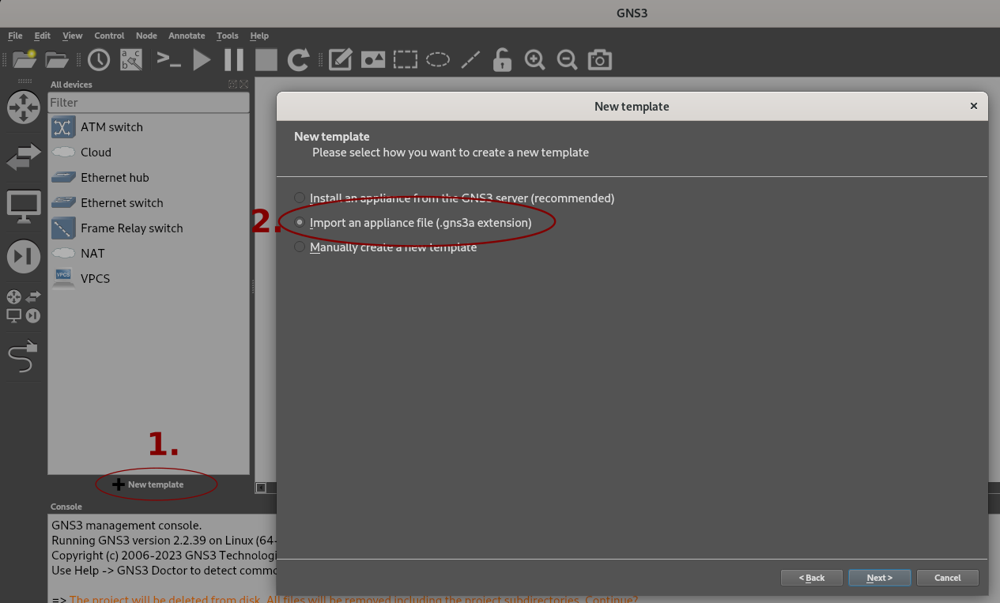

# How to install

1. Clone (or unzip) this repo (folder)
2. Run `./install.sh`
3. Start GNS3
4. Import every appliance (`.gns3a` file)
	
	

If necessary run `./install.sh --pull` to enforce downloading everything.
